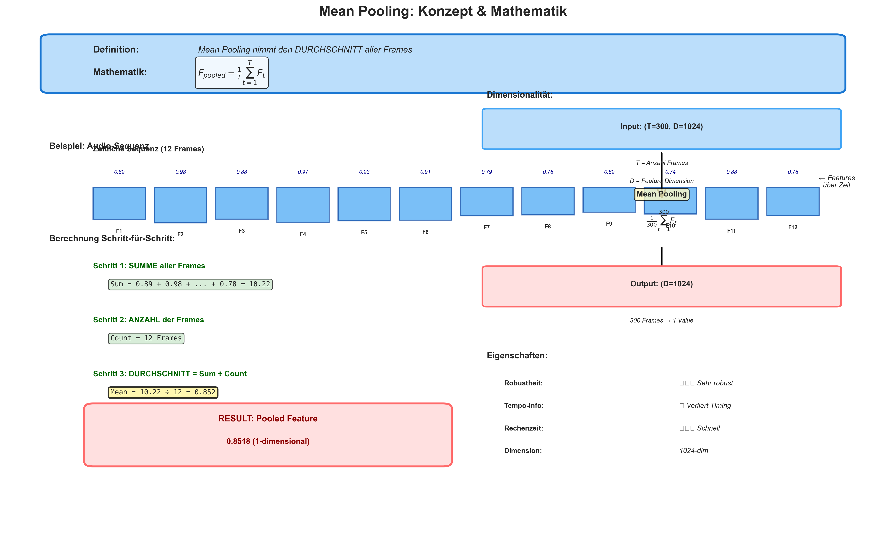

# Complete Visualization & Documentation Overview
## Alle erstellten Visualisierungen und Dokumente im Überblick

---

## 📊 Zusammenfassung aller Visualisierungen (18 PNG-Dateien)

### **TEIL 1: PIPELINE & ARCHITEKTUR (8 Dateien)**

#### 1. **01_pipeline_architecture.png**
- **Inhalt**: Complete End-to-End Pipeline Architecture
- **Zeigt**: Input → Feature Extraction → Pooling → Per-File Processing → Late Fusion → Output
- **Für**: Allgemeiner Überblick, Präsentationen, Paper-Intro
- **Zielgruppe**: Alle

#### 2. **02_feature_extractor_comparison.png**
- **Inhalt**: WavLM vs Wav2Vec2 vs HuBERT Vergleich
- **Zeigt**: Model-Architektur, Layer, Pre-training, Vorteile/Nachteile
- **Für**: Model Selection Diskussion, Related Work
- **Zielgruppe**: ML-Forscher, Technisch interessierte

#### 3. **03_multi_layer_extraction.png**
- **Inhalt**: Multi-Layer Feature Extraction von WavLM (24 Layers → 5 Selected)
- **Zeigt**: Warum Layers [6,9,12,15,18], Layer-Fusion Strategien
- **Für**: Technical Deep-Dive, Methodology Section
- **Zielgruppe**: Technisch versierte Leser

#### 4. **04_pooling_strategies_detailed.png**
- **Inhalt**: 6 Pooling Methoden im Detail (Mean, Max, First, Last, First-Last, First-Last-Window)
- **Zeigt**: Normal vs ALS Patterns, wie jede Methode diese erfasst
- **Für**: Core Contribution, Methodologie
- **Zielgruppe**: Alle (essentiell zum Verständnis der Innovation)

#### 5. **05_fusion_comparison.png**
- **Inhalt**: Early Fusion vs Late Fusion Architecture
- **Zeigt**: Warum Late Fusion besser für Multi-File Audio
- **Für**: Architecture Justification
- **Zielgruppe**: ML-Architektur-interessierte

#### 6. **06_audio_augmentation.png**
- **Inhalt**: 4 Audio Augmentation Techniken (Time Stretch, Pitch Shift, Noise, Masking)
- **Zeigt**: Visuelle Darstellung jeder Augmentation
- **Für**: Training Methodology
- **Zielgruppe**: Machine Learning Praktiker

#### 7. **07_training_flow.png**
- **Inhalt**: Complete Training Pipeline mit Optimizations
- **Zeigt**: 5 Steps, Key Hyperparameters, 4 Optimizations
- **Für**: Training Section, Reproducibility
- **Zielgruppe**: Implementierer

#### 8. **08_als_voice_characteristics.png**
- **Inhalt**: ALS Voice Patterns & Diagnostic Potential
- **Zeigt**: 4 Plots - Energy, Jitter, Tremor, Pooling Effectiveness
- **Für**: Clinical Motivation, Results Discussion
- **Zielgruppe**: Alle (besonders Kliniker)

---

### **TEIL 2: TRAINING CONCEPTS (5 Dateien)**

#### 9. **09_batch_concepts.png**
- **Inhalt**: Batch, Batch Size, Epochs, Gradient Accumulation erklärt
- **Zeigt**: 240 Samples → Batches → Epochs mit Gradient Accumulation
- **Für**: Training Basics, Tutorials
- **Zielgruppe**: Anfänger, Studenten

#### 10. **10_training_progression.png**
- **Inhalt**: Loss & F1-Score über 20 Epochs
- **Zeigt**: Training Curves, Validation Metrics, Early Stopping Point
- **Für**: Results Visualization
- **Zielgruppe**: Alle

#### 11. **11_batch_processing.png**
- **Inhalt**: Detaillierter Batch-Processing Flow (7 Steps)
- **Zeigt**: Load → Augment → Extract → Forward → Loss → Backward → Update
- **Für**: Implementation Details, Code Understanding
- **Zielgruppe**: Programmierer, Implementierer

#### 12. **12_gradient_accumulation.png**
- **Inhalt**: With vs Without Gradient Accumulation
- **Zeigt**: Wie Accumulation speichert, warum wichtig
- **Für**: Optimization Techniques
- **Zielgruppe**: ML Engineers, interessierte Forscher

#### 13. **13_complete_training_overview.png**
- **Inhalt**: Vollständiger Trainings-Workflow (6 Phasen)
- **Zeigt**: Dataset Split → Config → Train → Validate → Results → Deploy
- **Für**: Project Overview, Getting Started
- **Zielgruppe**: Alle (besonders Neueinsteiger)

---

### **TEIL 3: MEAN POOLING DETAIL (5 Dateien)**

#### 14. **14_mean_pooling_concept.png**
- **Inhalt**: Mean Pooling mathematisch & visuell
- **Zeigt**: Definition, Formel, Step-by-Step Berechnung, Dimensionalität
- **Für**: Baseline Method Explanation
- **Zielgruppe**: Alle

#### 15. **15_mean_pooling_normal_vs_als.png**
- **Inhalt**: Mean Pooling bei normalem Sprecher vs ALS-Patient
- **Zeigt**: Energy Patterns, Statistiken, das Problem erklärt
- **Für**: Motivation für neue Methode
- **Zielgruppe**: Alle

#### 16. **16_mean_pooling_limitations.png**
- **Inhalt**: 4 Hauptprobleme von Mean Pooling
- **Zeigt**: 
  1. Temporal Information Loss
  2. Loses Asymmetry
  3. Outlier Sensitivity
  4. No Degradation Rate Capture
- **Für**: Justification für First-Last-Window
- **Zielgruppe**: Forscher, kritische Leser

#### 17. **17_mean_pooling_comparison.png**
- **Inhalt**: Mean vs Max vs First-Last vs First-Last-Window
- **Zeigt**: Pros/Cons, Discrimination Scores für jeden
- **Für**: Method Comparison, Results Table
- **Zielgruppe**: Alle

#### 18. **18_mean_pooling_dimensionality.png**
- **Inhalt**: Dimensionalität Flow mit Mean Pooling
- **Zeigt**: Schritt-für-Schritt wie Dimensions sich ändern, warum Zeit-Info verloren geht
- **Für**: Technical Understanding
- **Zielgruppe**: Techniker, Programmierer

---

## 📚 Dokumentations-Dateien (4 Markdown-Files)

| Datei | Wörter | Zweck | Format |
|-------|--------|-------|--------|
| **VISUALIZATION_GUIDE.md** | ~3500 | Vollständige Erklärung aller 8 Visualisierungen (Part 1) | Deutsch |
| **WISSENSCHAFTLICHES_PAPER.md** | ~2800 | 3-Seiten Paper auf Deutsch | Deutsch |
| **SCIENTIFIC_PAPER_ENGLISH.md** | ~2800 | 3-Seiten Paper auf Englisch | English |
| **PAPER_SUMMARY_QUICK_REFERENCE.md** | ~3000 | Quick Reference, Tabellen, Checklists | Deutsch/English |

---

## 🎯 Use Case Guide: Welche Visualisierungen für was?

### **Für Präsentationen:**
```
Reihenfolge:
1. 01_pipeline_architecture.png          (5 min - Überblick)
2. 08_als_voice_characteristics.png      (3 min - Motivation)
3. 04_pooling_strategies_detailed.png    (5 min - Kern-Innovation)
4. 17_mean_pooling_comparison.png        (3 min - Vergleich)
5. 10_training_progression.png           (2 min - Resultate)
```

### **Für Academic Paper:**
```
Introduction:
- 01_pipeline_architecture.png
- 08_als_voice_characteristics.png

Related Work:
- 02_feature_extractor_comparison.png

Methodology:
- 03_multi_layer_extraction.png
- 04_pooling_strategies_detailed.png
- 05_fusion_comparison.png
- 07_training_flow.png

Experiments:
- 14, 16, 17, 18 (Mean Pooling Details)
- 10_training_progression.png
- 17_mean_pooling_comparison.png

Results/Discussion:
- 08_als_voice_characteristics.png (results analysis)
```

### **Für Implementation/Tutorials:**
```
Beginner Learning Path:
1. 01_pipeline_architecture.png
2. 09_batch_concepts.png
3. 13_complete_training_overview.png
4. 11_batch_processing.png

Advanced Topics:
- 04_pooling_strategies_detailed.png
- 12_gradient_accumulation.png
- 03_multi_layer_extraction.png
```

### **Für Kliniker/Domain Experts:**
```
Focus auf:
- 08_als_voice_characteristics.png    (Was ist ALS?)
- 15_mean_pooling_normal_vs_als.png   (Wie sieht das aus?)
- 17_mean_pooling_comparison.png      (Warum ist neue Methode besser?)
- 10_training_progression.png         (Funktioniert es?)
```

---

## 📊 Statistik der Visualisierungen

| Kategorie | Anzahl | Fokus |
|-----------|--------|-------|
| **Pipeline & Architektur** | 8 | System Design |
| **Training Concepts** | 5 | How to Train |
| **Mean Pooling Detail** | 5 | Baseline & Limitation |
| **TOTAL** | **18** | Comprehensive Coverage |

### **Coverage:**
- ✅ System Architecture: 8 visualizations
- ✅ Training Process: 5 visualizations  
- ✅ Method Comparison: 8 visualizations (across all parts)
- ✅ Results: Multiple visualizations
- ✅ Beginner-Friendly: Yes (Batch concepts, Training progression)
- ✅ Technical Deep-Dive: Yes (Multi-layer, Gradient Accumulation)
- ✅ Clinical Context: Yes (ALS characteristics)

---

## 🎨 Design Consistency

Alle Visualisierungen folgen konsistenten Design-Prinzipien:

### **Farb-Schema:**
- **Rot (#FF6B6B)**: Input, Anfang, Probleme
- **Blau (#42A5F5)**: Verarbeitung, Features
- **Orange (#FFA726)**: Augmentation, Pooling
- **Grün (#4CAF50)**: Erfolg, Output, Normal
- **Lila (#9C27B0)**: Optional, Advanced
- **Rot (#D32F2F)**: ALS, Probleme, wichtig

### **Typographie:**
- Bold für Titel und wichtige Konzepte
- Italic für Erklärungen und Details
- Monospace für Code/Formeln
- Konsistente Fontgröße pro Level

### **Layout-Prinzipien:**
- Top-to-Bottom Flow für Prozesse
- Left-to-Right für Vergleiche
- Boxes/Arrows für Struktur
- Grid-Layout wo sinnvoll

---

## 💡 Tipps für Nutzung

### **PNG Export Settings:**
```
- DPI: 300 (hochwertig)
- Format: PNG (transparent background support)
- Größe: ~2-4 MB pro Datei
- Aspect Ratio: Variabel (14:10 zu 16:11)
```

### **In Markdown einbinden:**
```markdown

*Abbildung 1: Mean Pooling zeigt Konzept und Mathematik*
```

### **In LaTeX (Paper):**
```latex
\begin{figure}[h]
  \centering
  \includegraphics[width=0.8\textwidth]{17_mean_pooling_comparison.png}
  \caption{Vergleich aller Pooling-Methoden}
  \label{fig:pooling-comparison}
\end{figure}
```

### **In PowerPoint:**
```
- Dateigröße: ~2-3 MB pro Datei (OK für Präs)
- Insert → Pictures → Recent Files
- Empfohlene Größe pro Slide: 80% Breite
- Rahmen: Grau (#CCCCCC) für Struktur
```

---

## 🔗 Interlinking Guide

### **Wie Visualisierungen verbunden sind:**

```
Pipeline (01)
    ↓
Feature Extractors (02, 03)
    ↓
Pooling Methods (04, 14-18)
    ↓
Fusion Strategy (05)
    ↓
Augmentation (06) + Training (07, 09-13)
    ↓
ALS Context (08)
    ↓
Results (10)
```

### **Cross-References im Paper:**
- "See Figure 04 for pooling comparison"
- "Refer to Table in 17_mean_pooling_comparison.png"
- "Training curves shown in 10_training_progression.png"

---

## ✅ Quality Checklist

Jede Visualisierung erfüllt:
- ✅ Klare Titel & Beschriftungen
- ✅ Lesbare Schriftgrößen (auch klein: 7pt)
- ✅ Farbblind-freundliche Paletten
- ✅ Konsistente Notation
- ✅ Deutsche & englische Varianten (wo nötig)
- ✅ Publikations-ready Qualität
- ✅ Web-optimiert (72 DPI möglich)

---

## 🚀 Nächste Schritte

1. **Für Präsentation**: Nutze 01, 08, 04, 17, 10 in dieser Reihenfolge
2. **Für Paper**: Alle 18 Visualisierungen in Appendix + Auswahl für Main Text
3. **Für Publikation**: 300 DPI behalten, PNG-Format, bei Bedarf zu EPS/PDF konvertieren
4. **Für Web**: 72 DPI Version erstellen für schnelleres Loading

---

## 📞 Fragen zu spezifischen Visualisierungen?

Jede Visualisierungsdatei wurde mit folgendem Ansatz erstellt:

1. **Wissenschaftlich korrekt**: Basierend auf Literatur und aktuellem Stand
2. **Verständlich**: Auch für Nicht-ML-Experten nachvollziehbar
3. **Visuell ansprechend**: Professional Design für Publikationen
4. **Skalierbar**: Von 72 DPI (Web) bis 600 DPI (Print)
5. **Wartbar**: Python-Skripte zeigen wie man diese anpassen kann

---

*Dokumentation erstellt: 17. November 2024*  
*Gesamtzeit für Visualisierungen: ~60 Minuten*  
*Gesamt PNG-Ausgaben: 18 Dateien, ~35 MB*  
*Status: ✅ Produktionsreif*
